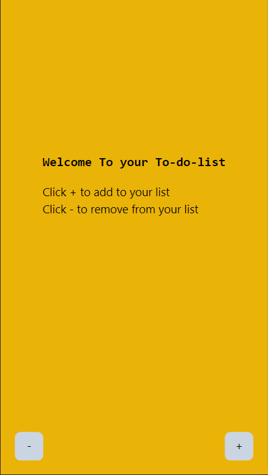
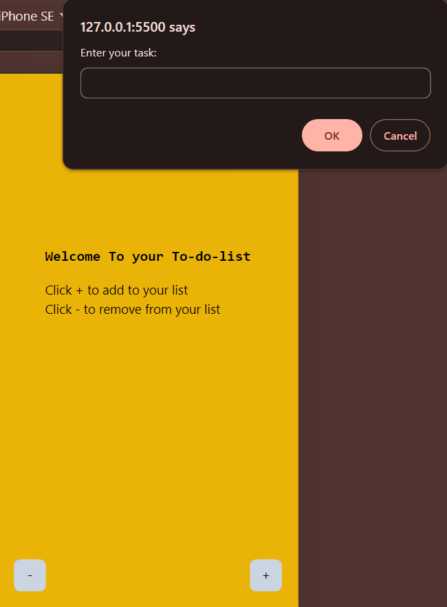
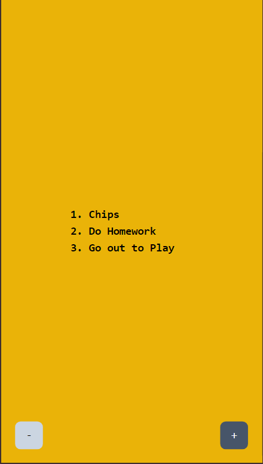
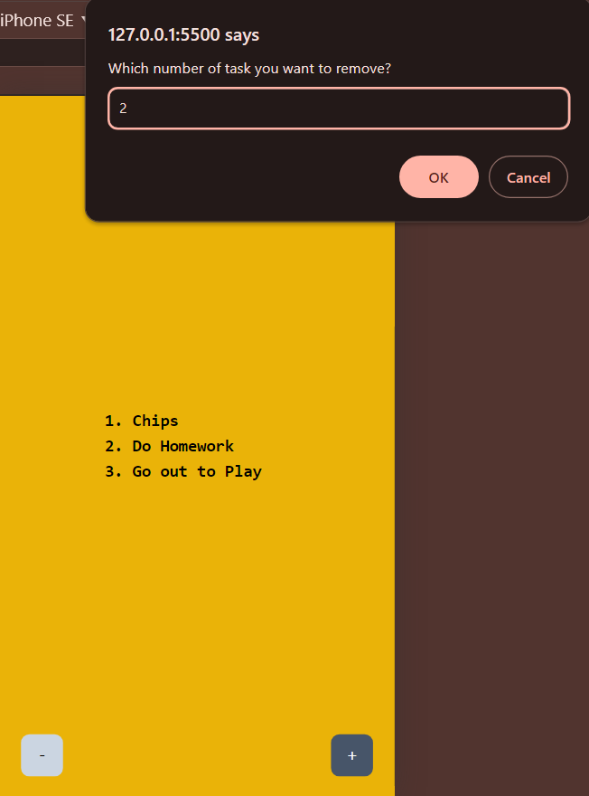
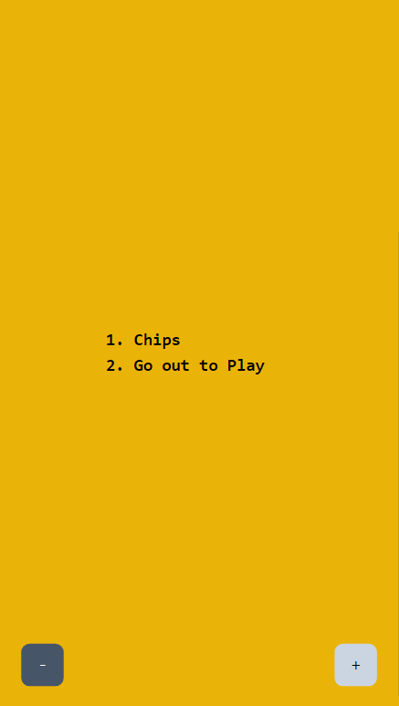

## This is a simple To-do list webapp made using html,tailwindCss and Js.

## The Bugs

1. After adding items in the list, while removing, if the user enters an invalid number that doesn't match the list count, it shows the invalid message, but after that, the existing list won't appear.

2. If the user tries to remove a list item without creating a list, it shows the "no item to remove" error, but after that if the user tries to add list items, they won't appear.

## App Photos

Here are some photos of the app:

1. 
2. 
3. 
4. 
5. 
